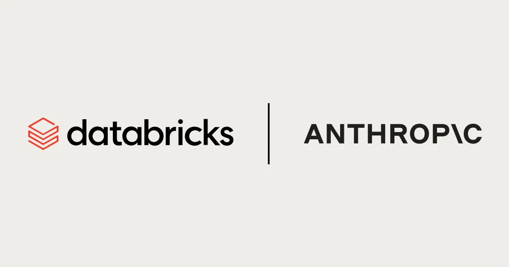

## Visão Geral
Este projeto demonstra como usar o Claude (LLM da Anthropic) para gerar consultas SQL automaticamente a partir de perguntas em linguagem natural em um ambiente Databricks. Esta solução preenche a lacuna entre usuários corporativos e consultas de dados técnicos, permitindo a geração de consultas com melhor desempenho.
## Objetivos
`1. Simplificar o acesso aos dados por meio da linguagem natural`
  - Permitir que usuários não técnicos (por exemplo, analistas, usuários empresariais) acessem dados sem precisar escrever SQL.
  - Preencher a lacuna entre a compreensão da linguagem natural e a recuperação de dados estruturados.

`2. Integrar Claude aos fluxos de trabalho do Databricks`
  - Demonstrar como conectar com segurança a API Claude da Anthropic em um ambiente Databricks.
  - Usar Claude para gerar instruções SQL precisas e sensíveis ao contexto.

`3. Automatizar a geração de consultas SQL`
  - Converter perguntas ou prompts do usuário em consultas SQL sintaticamente corretas usando a saída gerada pelo LLM.
  - Lidar com diferentes tipos de consultas: agregação, filtragem, agrupamento, ordenação, etc.
## Tecnologias
- Databricks (Workspace, SQL Warehouses)
- API Anthropic Claude (via HTTPS)
- Python (notebooks do Databricks, solicitações)
- Delta Lake (Opcional: armazenamento de logs, histórico de consultas)
- SQL (exemplos de consultas)
- Processamento de Linguagem Natural (Engenharia de Prompts)
## Arquitetura

## Documentações Utilizadas
https://www.databricks.com/blog/anthropic-claude-37-sonnet-now-natively-available-databricks
#
#
#

## Overview
This project demonstrates how to use Claude (Anthropic's LLM) to automatically generate SQL queries from natural language questions in a Databricks environment. This solution bridges the gap between business users and technical data queries, enabling the generation of better performing queries.
## Objectives
`1. Simplifing Data Access Through Natural Language`
  - Enabling non-technical users (e.g., analysts, business users) to access data without needing to write SQL.
  - Bridging the gap between natural language understanding and structured data retrieval.

`2. Integrating Claude into Databricks Workflows`
  - Demonstrating how to securely connect Anthropic’s Claude API within a Databricks environment.
  - Using Claude to generate context-aware, accurate SQL statements.

`3. Automating SQL Query Generation`
  - Converting user questions or prompts into syntactically correct SQL queries using LLM-generated output.
  - Handling different types of queries: aggregation, filtering, grouping, ordering, etc.
## Technologies
 - Databricks (Workspace, SQL Warehouses)
 - Anthropic Claude API (via HTTPS)
 - Python (Databricks notebooks, requests)
 - Delta Lake (Optional: storing logs, query history)
 - SQL (sample queries)
 - Natural Language Processing (Prompt Engineering)
 ## Architecture

 ## Documentation Used
 https://www.databricks.com/blog/anthropic-claude-37-sonnet-now-natively-available-databricks